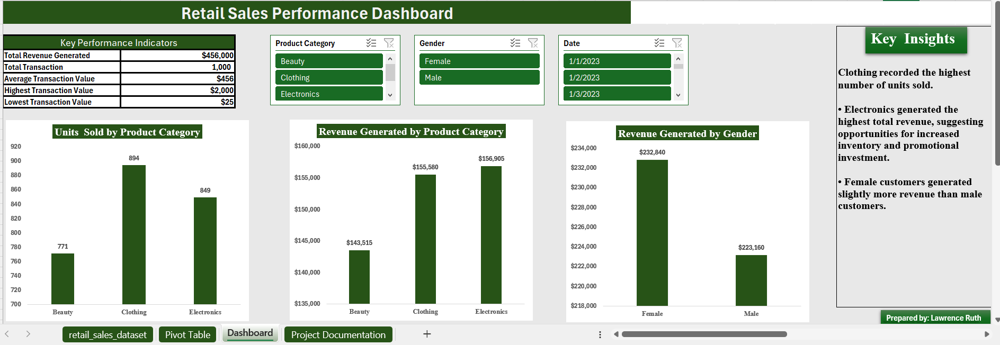

# 📊 Retail Sales Performance Dashboard

An end-to-end Microsoft Excel data analytics project that transforms raw retail sales data into actionable business insights through data cleaning, PivotTables, PivotCharts, KPI reporting, and an interactive dashboard.

---

# Dashboard Preview

---

# Project Overview

Businesses generate thousands of transactions every month, but raw data alone does not support effective decision-making.

This project analyzes retail sales performance to uncover trends in revenue, customer demographics, and product performance while demonstrating the complete Excel data analysis workflow.

The project focuses on turning raw transactional data into meaningful business insights that management can use to improve decision-making.

---

# Business Problem

Imagine a retail business making hundreds of sales every week without knowing:

- Which products generate the most revenue
- Which customer group spends the most
- Which category sells the highest quantity
- Which KPIs should be monitored regularly

Without these insights, business decisions rely on assumptions rather than evidence.

This project solves those business questions through data analysis.

---

# Project Objectives

The objective of this project was to:

- Clean and validate retail sales data
- Analyze customer purchasing behavior
- Measure business performance using KPIs
- Identify high-performing products
- Design an interactive dashboard
- Generate business recommendations supported by data

---

# Dataset Information

**Source:** Kaggle

The dataset contains over **1,000 retail sales transactions** including:

- Transaction ID
- Date
- Customer ID
- Gender
- Age
- Product Category
- Quantity
- Price per Unit
- Total Amount

---

# Tools Used

- Microsoft Excel
- PivotTables
- PivotCharts
- Slicers
- Conditional Formatting
- Excel Functions
- Dashboard Design

---

# Skills Demonstrated

✔ Data Cleaning

✔ Data Validation

✔ Data Analysis

✔ Excel Functions

✔ PivotTables

✔ PivotCharts

✔ KPI Reporting

✔ Interactive Dashboard Design

✔ Data Visualization

✔ Business Analysis

✔ Business Storytelling

---

# Project Workflow

The project followed a structured analytics process:

1. Data Exploration
2. Data Cleaning
3. Data Validation
4. Sorting & Filtering
5. Conditional Formatting
6. Excel Calculations
7. PivotTables
8. PivotCharts
9. Dashboard Design
10. Business Insights
11. Business Recommendations
12. Documentation

---

# Dashboard KPIs

The dashboard tracks important business metrics including:

- Total Revenue
- Total Transactions
- Average Revenue
- Quantity Sold
- Customer Demographics
- Product Category Performance

---

# Business Questions Answered

This project answers several key business questions:

- Which product category generated the highest revenue?
- Which product category sold the highest quantity?
- Which customer demographic contributed the most revenue?
- Which KPIs should management monitor?
- What sales trends can support business decisions?

---

# Dashboard Features

The dashboard includes:

- KPI Cards
- Interactive Slicers
- Revenue Analysis
- Product Category Analysis
- Customer Demographic Analysis
- PivotCharts
- Executive Summary

---

# Key Business Insights

Some important findings include:

- Revenue performance differs from sales volume.
- The highest-selling product category is not necessarily the highest revenue generator.
- Customer demographics influence purchasing behavior.
- Interactive filtering improves decision-making.

---

# Business Recommendations

Based on the analysis:

- Invest more in high-revenue product categories.
- Monitor customer purchasing patterns regularly.
- Track KPIs monthly using dashboards.
- Use demographic insights to improve marketing campaigns.
- Continue monitoring sales trends for better inventory planning.

---

# Project Files

This repository contains:

- Excel Dashboard Workbook 📥 [Download the Excel Dashboard](Retail_Sales_Performance_Dashboard.xlsx.)
- Dashboard Screenshot 
- Project Documentation
- README 
- Walkthrough Video *(Coming Soon)*

---

# How to Use

1. Download the Excel workbook.
2. Open using Microsoft Excel.
3. Navigate to the Dashboard sheet.
4. Use the slicers to interact with the report.
5. Review the documentation sheet for project details.

---

# What I Learned

This project strengthened my understanding of:

- Excel as a business intelligence tool
- Dashboard design principles
- KPI reporting
- Business storytelling with data
- Data-driven decision making

More importantly, it taught me that data analysis is not just about creating charts—it's about solving real business problems and communicating insights clearly.

---

# Future Improvements

Future versions of this project will include:

- Power BI dashboard
- SQL data extraction
- Python data analysis
- Automated reporting
- Time-series sales analysis

---

# About Me

I'm a business intelligence Data Analyst passionate about transforming data into meaningful business insights.

I'm currently building advanced portfolio projects while developing more skills in:

- Excel
- SQL
- Power BI
- Python
- Business Analytics

---

# Connect With Me

LinkedIn:
(www.linkedin.com/in/ruth-lawrence-8519073b7)

GitHub:
https://github.com/lawrenceruth98-prog

Email:
(lawrenceruth34@gmail.com)

---

⭐ If you found this project interesting, feel free to star the repository.
